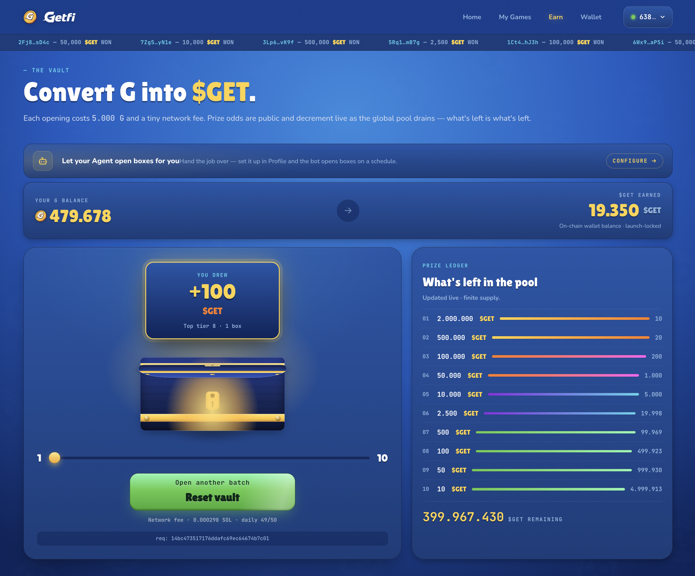

# GetFi — Roll Raider Hub & Agent Bot

### 🖥️ Project Showcase

*A visual preview of the GetFi dApp interface running locally.*

---

### 🔗 Solana Devnet Identifiers
| Component | Address / Identifier |
| :--- | :--- |
| **$GET Token (V2)** | `3rTrMpMPQ3Nj7ktRkBYcLmB5diqqhtcw348oq9Poq5Eo` |
| **Lootbox Program** | `Bm6zsJgc87Hj6gGEtpHtyjP89Lwuu7TequM6dgPL8LA7` |
| **Program Authority** | `A3TgoR4...FqxFqxb` |

---

Monorepo for the GetFi hackathon submission. Contains two production services that share an on-chain `getfi_lootbox` Anchor program on Solana devnet:

- **`hub/`** — Next.js 16 dApp at `hub.getfi.org`. Web2 ↔ Web3 bridge for player onboarding, wallet linking, and lootbox openings. → [hub/README.md](./hub/README.md)
- **`bot/`** — Telegram-native AI assistant (RaiderBot). Onboards players, answers questions via OpenAI Responses + RAG, and runs an on-chain agent mode that opens lootboxes for users who delegate authority. → [bot/README.md](./bot/README.md)

The Anchor program (`hub/getfi_lootbox/`) and its migration playbook (`hub/getfi_lootbox/MIGRATION.md`) are shared between the two services.

## Stack at a glance
Next.js 16 · React 19 · Tailwind v4 · Firebase (Auth + Firestore + Cloud Functions) · Solana web3.js · Anchor 0.30.1 · OpenAI Responses API · Telegraf v4

## License
MIT — see individual project LICENSE files.
